COMUNIDADES GIT

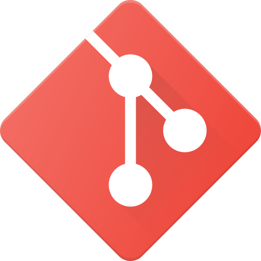

Introducción

El control de versiones es una práctica fundamental en el desarrollo de
software y en la gestión de proyectos colaborativos. Consiste en
registrar y administrar los cambios que se realizan sobre archivos y
código fuente, de manera que sea posible volver atrás en el tiempo,
comparar versiones, trabajar en paralelo y coordinar equipos de
desarrollo de forma eficiente.

Listado de comunidades de Git

A continuación un listado algunas comunidades de Git:

-   -   -   ### GitLab

        -   ### Bitbucket

        -   ### Azure DevOps Repos 

        -   ### Codeberg

        -   ### Google Cloud Source Repositories (Git)

GitLab

1\. Darse de alta y crear el repositorio

Tras registrarnos y darnos de alta en GitLab procederemos a crear
nuestro nuevo repositorio:

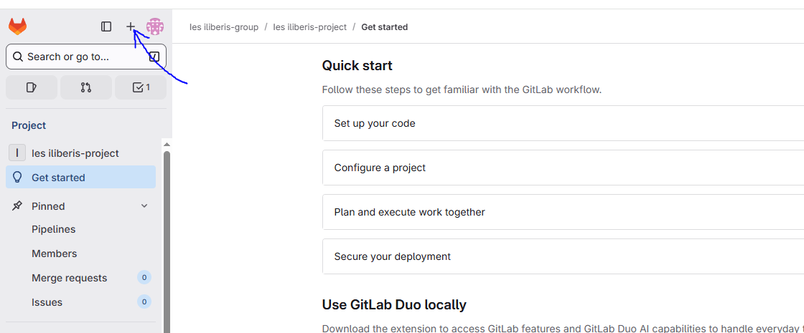

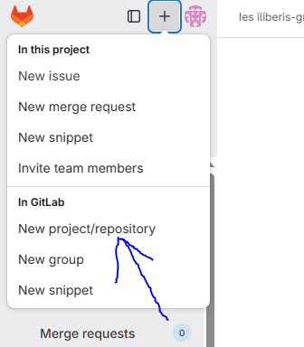

Crearemos nuestro nuevo proyecto totalmente vacío.

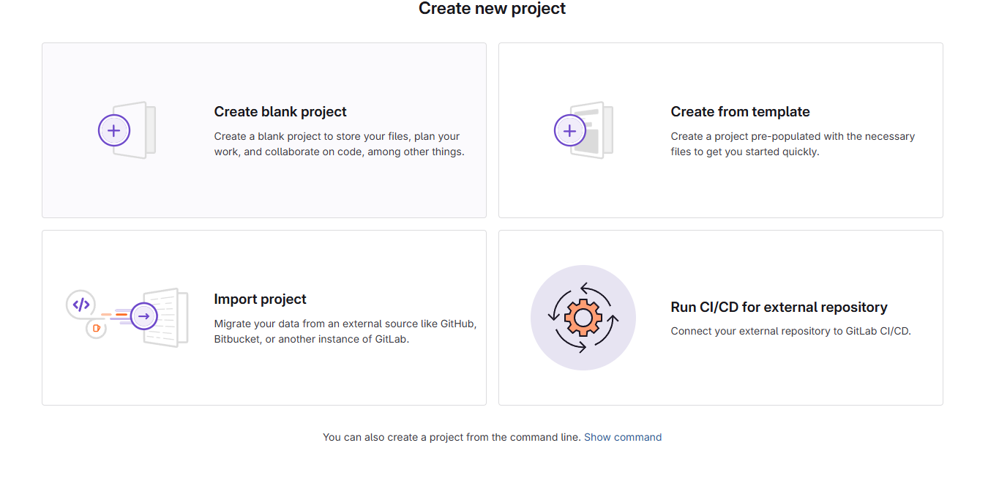

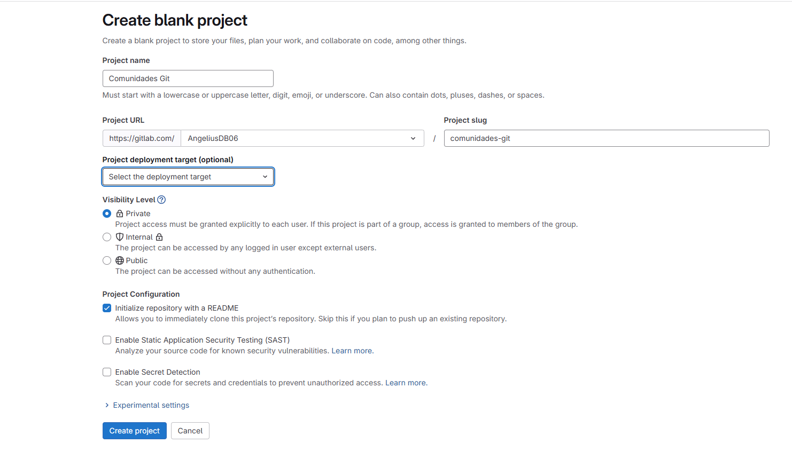2. Clonar el repositorio

Una vez creado copiaremos la dirección HTTP para clonar nuestro
repositorio.

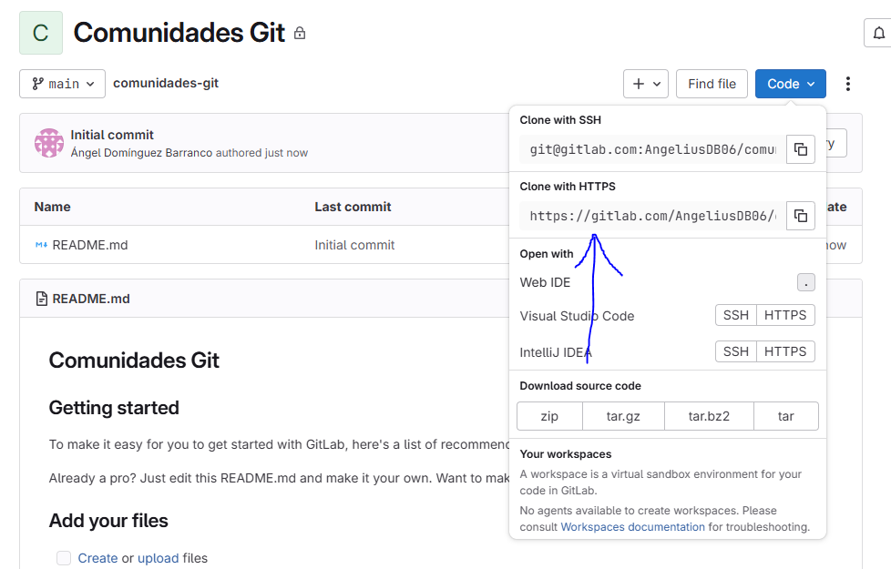

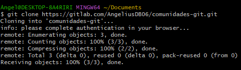

**3. Crear un archivo y hacer un commit**

A continuación crearemos nuestro archivo y haremos el commit y
posteriormente un push origin.

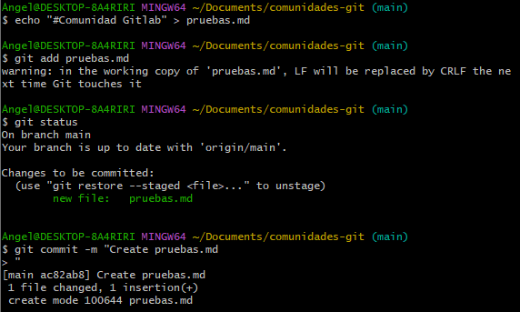

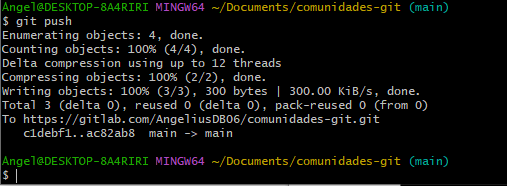

Podemos comprobar que ha funcionado refrescando la página de GitLab.

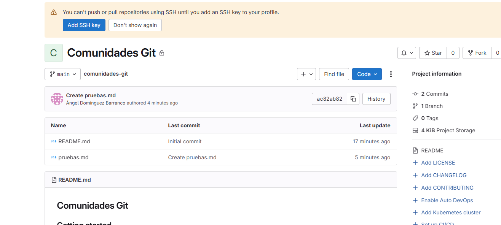

4\. Actualizar la rama en Git Bash

Crearemos un nuevo archivo desde nuestro GitLab para posteriormente
actualizar nuestra rama en Git Bash y que se produzcan los cambios.

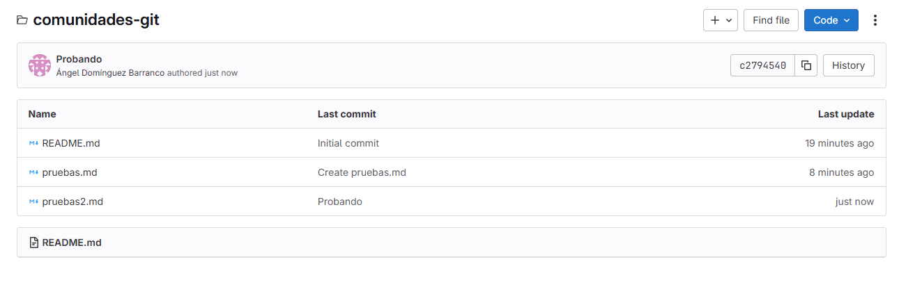

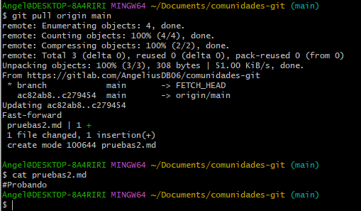

Codeberg

A continuación habrá una serie de capturas realizando los mismos pasos
pero utilizando Codeberg.

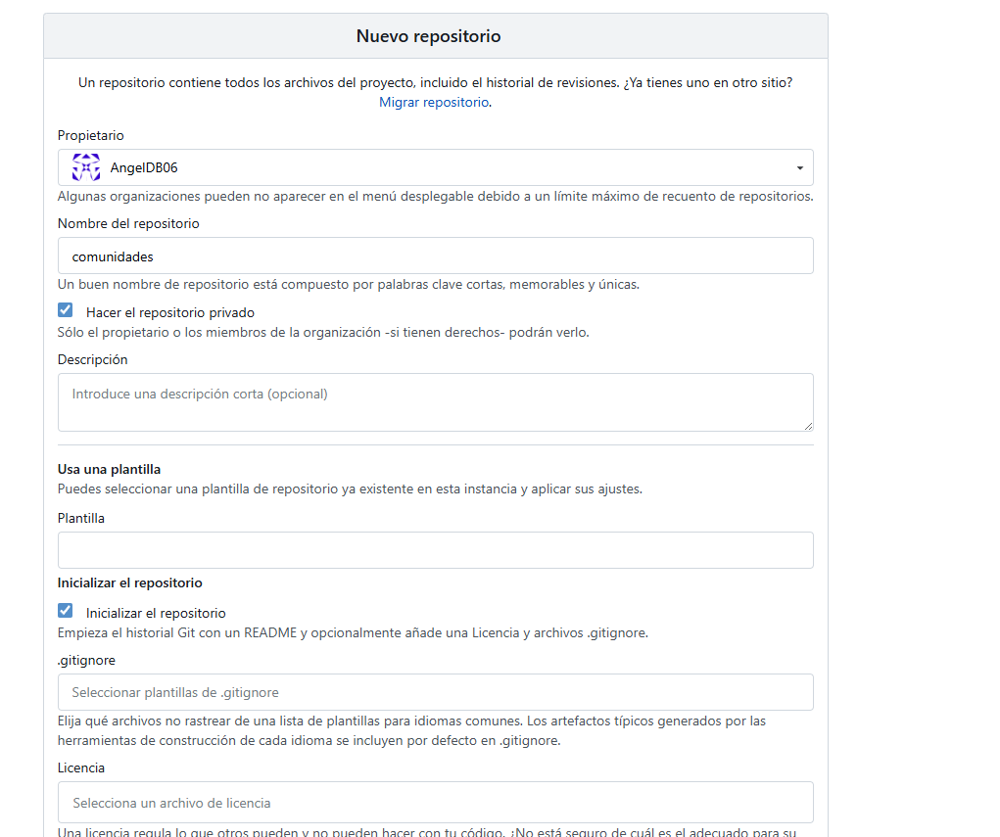

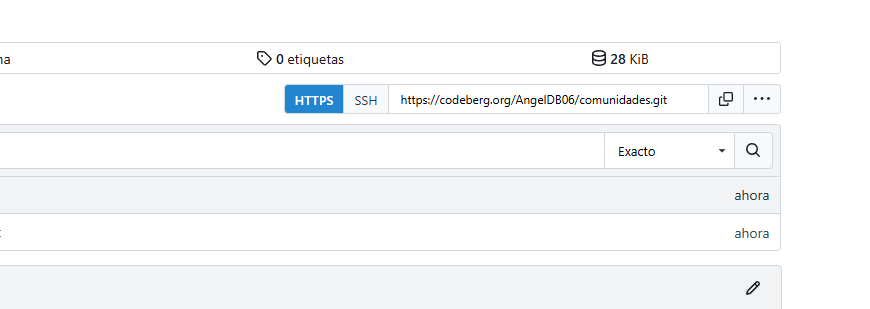

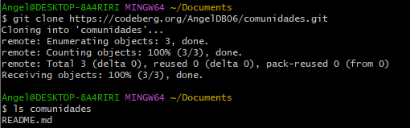

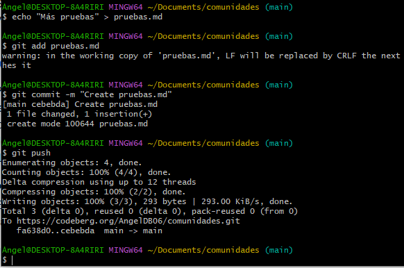

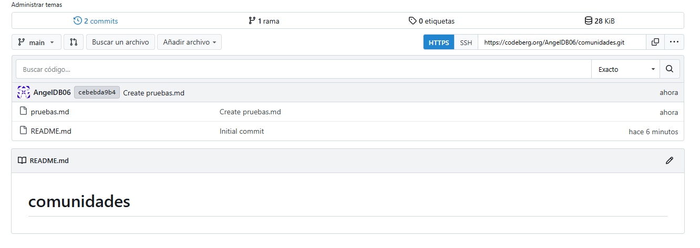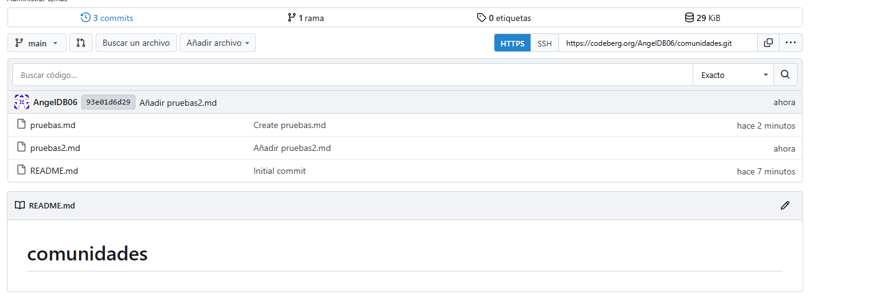}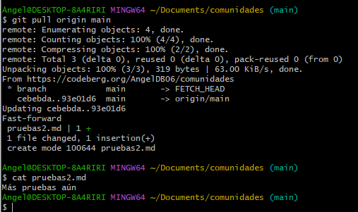

**Conclusión**

Todas las comunidades de Git son igual de funcionales para subir
archivos, clonarlos, trabajar en grupo y obtener actualizaciones del
repositorio.
